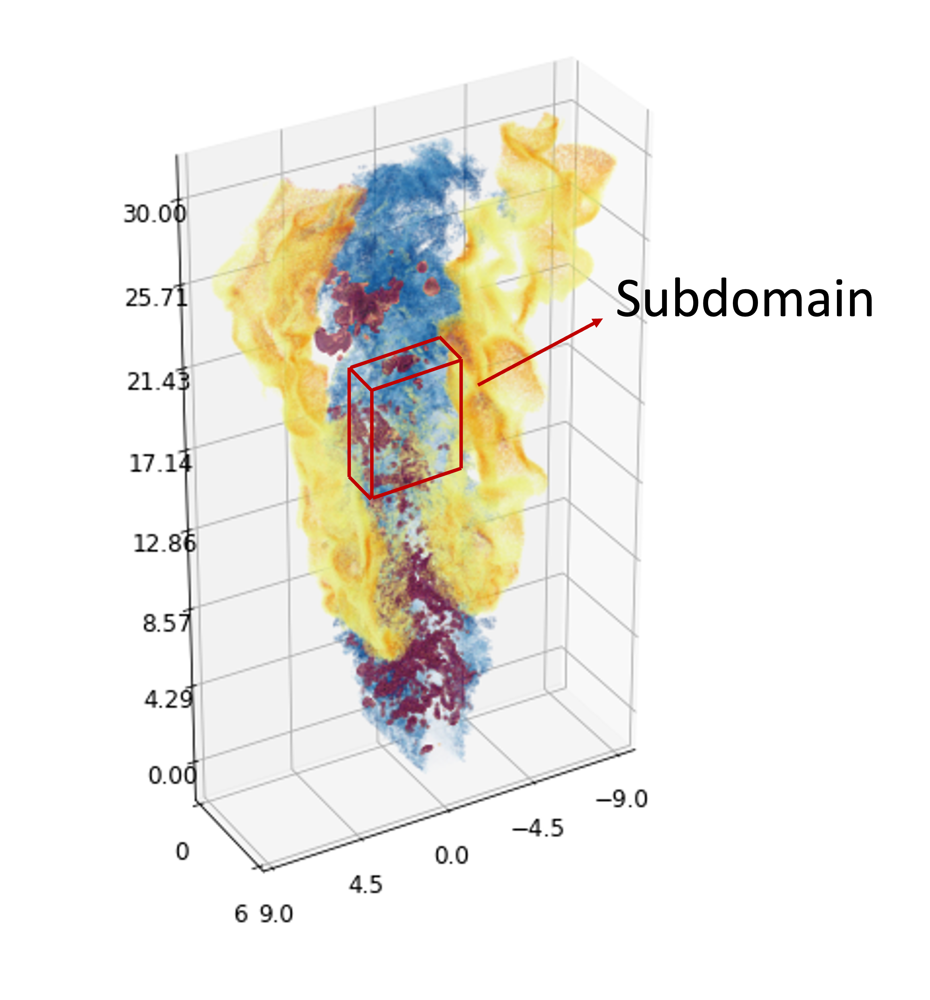

# Quickstart

Once installed the library, make sure to download some formatted DNS data to run the following code.

Apriori uses the same format that is available on [Blastnet](https://blastnet.github.io). In case you want to use a practical case, you can download a dataset directly from their website. The current version of the package is just able to handle one timeframe, so make sure to download a case that contains a single timestep.

In alternative, it's available on Github a reduced dataset, extracted from [this](https://blastnet.github.io/jung2021.html) Slot burner flame.&#x20;

<figure><figcaption></figcaption></figure>
