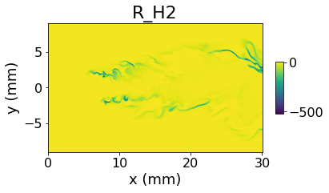

# What is aPriori?

<figure><figcaption></figcaption></figure>

## Scope of the Project

aPriori is a Python package used to process DNS data. The project aims to help make large datasets more accessible to everyone, both to those who come from the field of Combustion and Fluid Dynamics, and who come from other fields.&#x20;

### Why should you use DNS data?

With the advent of Data Science, large datasets of Direct Numerical Simulations (DNS) are becoming more and more useful for scientists. Due to their super high resolution, these can be extremely powerful for training Machine Learning models, or performing analysis to study the patterns of Turbulence and Chemistry.\
However, DNS simulations are often tricky to handle, due to their large dimensions and the fact that they can be stored in many different ways, depending on who performs the simulations. Moreover, who performs the simulations generally has access to very powerful computational resources, which is not always the case when someone else wants to perform analysis on those data. A major problem when working with DNS is running out of memory.

### Why should you use aPriori?

This package makes working with this complex data extremely intuitive. \
It also solves the problem of running out of memory and other issues that are typically encountered by combustion scientists.\
Instead of storing the files in variables, thus allocating memory in the system, this library uses pointers to the file location, so that the files containing the scalar variables is read only when needed, so the RAM of your system will not be overloaded.\
Performing complex chemistry computations on the dataset can be as simple as writing a couple of lines of code:

```python
// Some code
from aPriori.DNS import Field3D

my_field = Field3D('your/folder/with/data')
my_field.compute_source_terms() #computing the reaction rates for every specie

my_field.plot_z_midplane('R_O2') #Plotting the reaction rate of hydrogen
```

This snippet will finally give the following output:

<figure><figcaption></figcaption></figure>

